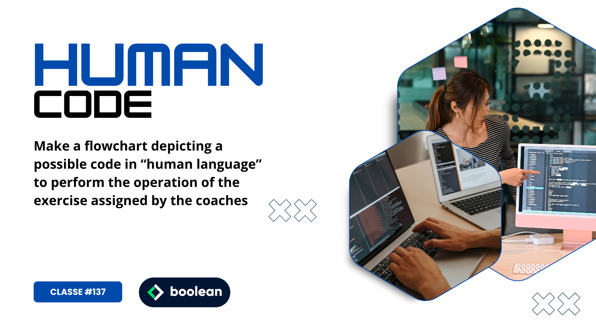

 
Sedicesimo Esercizio Classe #137 - Boolean

---

Studente: Fabio Ferrero

---
# English

## Target of the project:
Make a flowchart depicting a possible code in “human language” to perform the operation of the exercise assigned by the coaches

---
# Italiano

## Obiettivo del progetto:
Realizzare un diagramma di flusso che raffigura un eventuale codice in "lingua umana" per eseguire l'operazione dell'esercizio affidato dai coach

---

---
All'interno della repo è hostato lo screenshot dell'esercizio.